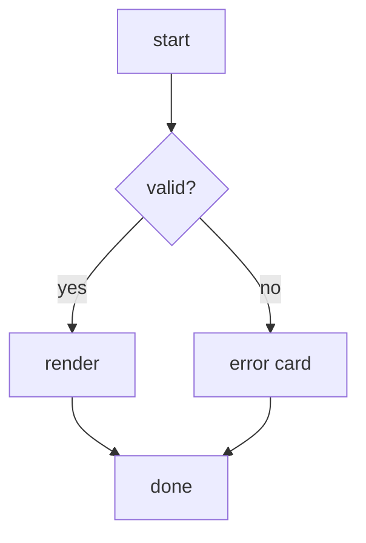

# getting started

a kitchen-sink markdown file. the TOC on the right should list **only** the
h1/h2/h3 headings below - the h4/h5/h6 ones must be ignored.

## section one - text

Some prose with **bold (peach)**, _italic_, `inline code`, and a
[link back to the index](README.md). Also a [jump to section three](#section-three---a-diagram).

### subsection 1a

A nested heading - should appear in the TOC.

#### h4 should be hidden

##### h5 should be hidden

###### h6 should be hidden

## section two - code + tables

```js
// javascript, highlighted
export function add(a, b) {
  return a + b;
}
```

```bash
# a shell block
npx projview ./docs --port 4500
```

```python
def greet(name: str) -> str:
    return f"hello {name}"
```

| col a | col b | col c |
| --- | --- | --- |
| 1 | two | three |
| 4 | five | six |

### subsection 2a - lists

- bullet one
- bullet two
  - nested bullet
    - deeper
- [ ] unchecked task
- [x] checked task

## section three - a diagram



> if the diagram above rendered and the TOC shows three h2s + two h3s (no h4-h6),
> this file passes.
