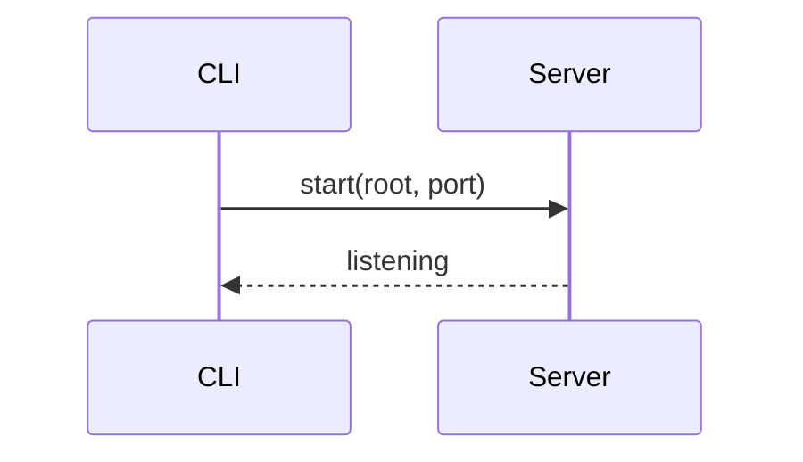

# configuration

Tests explicit `{#id}` heading anchors and a link to a **missing** anchor.

## ports {#ports}

projview picks a free port starting at 4321. Jump target: [#ports](#ports).

## env overrides {#env-overrides}

Set `PROJVIEW_PORT` to pin a port. This heading has an explicit id so
`configuration.md#env-overrides` resolves to it.

## a valid diagram

## broken anchor link

This link points at an anchor that doesn't exist on this page - it should
no-op gracefully (no jump, no crash): [go nowhere](#this-anchor-is-missing).

Back to [installation](installation.md).
