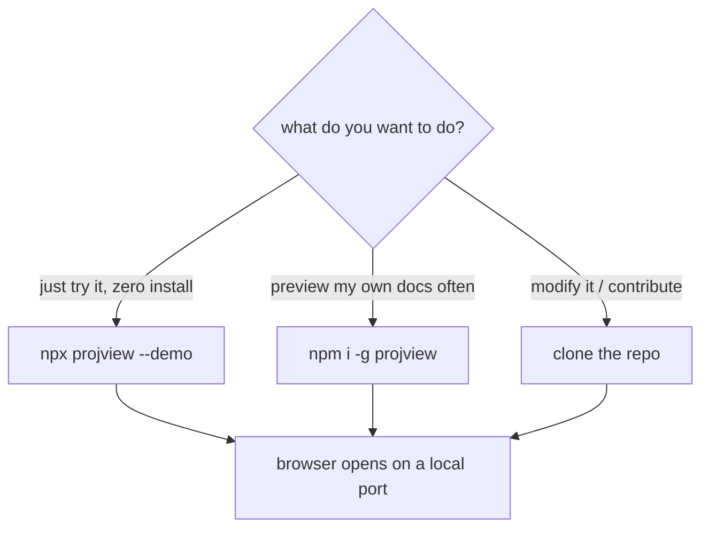

# how to set up projview

Everything you need to **install, run, or hack on** projview - a tiny local
previewer for markdown + mermaid files.

- 📦 npm: <https://www.npmjs.com/package/projview>
- 🐙 repo: <https://github.com/vikingsearth/projview>
- 🐛 issues: <https://github.com/vikingsearth/projview/issues>

## requirements

| need | version |
| --- | --- |
| Node.js | **18+** |
| npm | ships with Node |

No build step. By default indexing is in-memory and nothing is written to disk -
you can opt into a persistent store (sqlite / JSON / your own DB) below.

## pick your path



## 1. run instantly with npx (no install)

```bash
# preview the bundled sample docs (this very doc set)
npx projview --demo

# preview the current directory
npx projview

# point it somewhere, on a chosen port, without auto-opening the browser
npx projview ./docs --port 5000 --no-open
```

`npx` downloads + runs the latest published version, then cleans up.

## 2. install the CLI globally

```bash
npm i -g projview     # adds `projview` to your PATH
projview --demo       # try the sample docs
projview ~/notes      # preview any directory
```

To update later: `npm i -g projview@latest`. To remove: `npm rm -g projview`.

## 3. clone the repo + run from source

For hacking on projview itself, or running an unpublished build:

```bash
git clone https://github.com/vikingsearth/projview.git
cd projview
npm install

npm run demo                 # preview the bundled docs/  (alias for --demo)
npm start                    # index the current directory
node bin/projview.js ./docs  # or call the CLI directly
npm test                     # run the test suite (node:test, 29 tests)
```

See the [project README](README.md) for the architecture and the
[api reference](reference/api.md) for the HTTP surface.

## CLI reference

**Commands**

| command | meaning |
| --- | --- |
| `projview [path]` | start the viewer (default) |
| `projview search <query> [path]` | print ranked search results as JSON, then exit |
| `projview tree [path]` | print the file tree as JSON, then exit |

The `search` and `tree` subcommands are projview's **machine interface** - JSON on
stdout, no server, no browser - built for agents and scripts. See
[ai-tests/search.md](ai-tests/search.md) for a worked test.

**Options**

| argument / flag | meaning |
| --- | --- |
| `[path]` | directory to index (default: current directory) |
| `--demo` | use projview's own bundled sample docs (works with the subcommands too) |
| `-p`, `--port <n>` | preferred port (default `4321`, climbs if taken) |
| `--no-open` | don't auto-open the browser |
| `--persist` | keep the index in `~/.projview/cache` and reuse it next run |
| `--store <kind>` | store backend: `memory` \| `superlite` \| `lite` (default: `memory`; `lite` when `--persist`) |
| `--store-url <url>` | use a custom store: `sqlite://<file>` or `postgres://<...>` |
| `-v`, `--version` | print the version and exit |
| `-h`, `--help` | show help |

**Environment variables** (handy for containers / servers):

| var | default | use |
| --- | --- | --- |
| `PORT` | `4321` | port to serve on |
| `HOST` | `127.0.0.1` | interface to bind (`0.0.0.0` to expose) |
| `PROJVIEW_PERSIST` | `0` | `1` to persist the index (same as `--persist`) |
| `PROJVIEW_STORE` | `memory` | store backend (same as `--store`) |
| `PROJVIEW_STORE_URL` / `DATABASE_URL` | — | custom store connection URL (same as `--store-url`) |

## persistence & stores

By default projview is **ephemeral** - the index lives in memory and nothing is
written to disk. Opt in to persistence when you want a faster warm start or a
queryable store an AI can read:

| backend | what | how |
| --- | --- | --- |
| `memory` | in-memory, nothing persisted (**default**) | _(no flag)_ |
| `lite` | sqlite via Node's built-in `node:sqlite` | `--persist` (or `--store lite`) |
| `superlite` | a plain JSON file | `--store superlite --persist` |
| `custom` | your own DB via a connection URL | `--store-url sqlite://./my.sqlite` or `postgres://…` |

```bash
projview docs --persist                              # warm-start cache in ~/.projview/cache
projview docs --store-url "sqlite:///tmp/docs.sqlite"  # a sqlite file you choose
projview docs --store-url "$DATABASE_URL"            # your postgres (needs the `pg` package)
```

- **Locations:** persisted stores live in `~/.projview/cache/`; ephemeral ones in
  `~/.projview/ephemeral/` and are removed on ctrl-c. Defaults can be set in
  `~/.projview/config.json`.
- **Warm start:** on re-run, projview loads the cached index and only re-reads
  files whose modification time changed.
- **Postgres** needs the optional `pg` package (`npm i pg`). The connection URL
  comes from `--store-url` / `DATABASE_URL` / your config file - **never commit a
  connection string with credentials**; keep it in the environment.

## use the source directly (advanced)

The server is a small ES module you can embed. There's no stable public API yet,
so treat this as internal:

```js
import { startServer } from 'projview/src/server.js';

const { port, close } = await startServer(process.cwd(), { port: 4321, host: '127.0.0.1' });
console.log(`serving on http://127.0.0.1:${port}`);
// ... later
await close();
```

The client is plain ES modules under `public/` (`main.js` wires it together) -
no bundler, so you can read and tweak it directly.

## run it as a container (optional)

The repo ships a `Dockerfile` that serves the demo docs on port `8080`:

```bash
docker build -t projview-demo .
docker run -p 8080:8080 projview-demo   # then open http://localhost:8080
```

> Behind a TLS-intercepting proxy? Pass your corporate CA as a build secret:
> `docker build --secret id=cacert,src=corp-ca.pem -t projview-demo .` - the
> cert is used only during install and never written into an image layer.

## links & references

| | |
| --- | --- |
| repository | <https://github.com/vikingsearth/projview> |
| npm package | <https://www.npmjs.com/package/projview> |
| report a bug | <https://github.com/vikingsearth/projview/issues> |
| license | MIT |
| more docs | [getting started](getting-started.md) · [api reference](reference/api.md) · [glossary](reference/glossary.md) |
