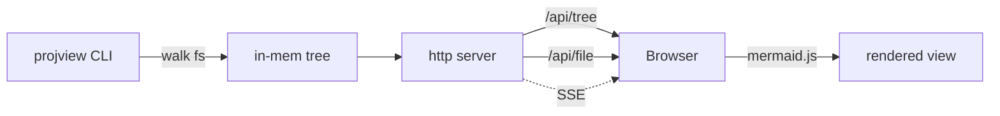

# architecture demo

a markdown file that mixes prose, a table, highlighted code, and an inline
mermaid diagram - so we can eyeball the whole renderer at once.

## request flow



## component table

| piece | job |
| --- | --- |
| `walk.js` | recursive fs scan -> tree |
| `render.js` | markdown-it + mermaid fence |
| `server.js` | http + SSE live reload |
| `app.js` | nav, viewer, mermaid run |

## a code block

```js
import { startServer } from './src/server.js';

const { port, close } = await startServer(process.cwd(), { port: 4321 });
console.log(`listening on ${port}`);
```

> if you can read this with a lavender heading, a striped table, a dark code
> block and a rendered flowchart - the renderer works.
